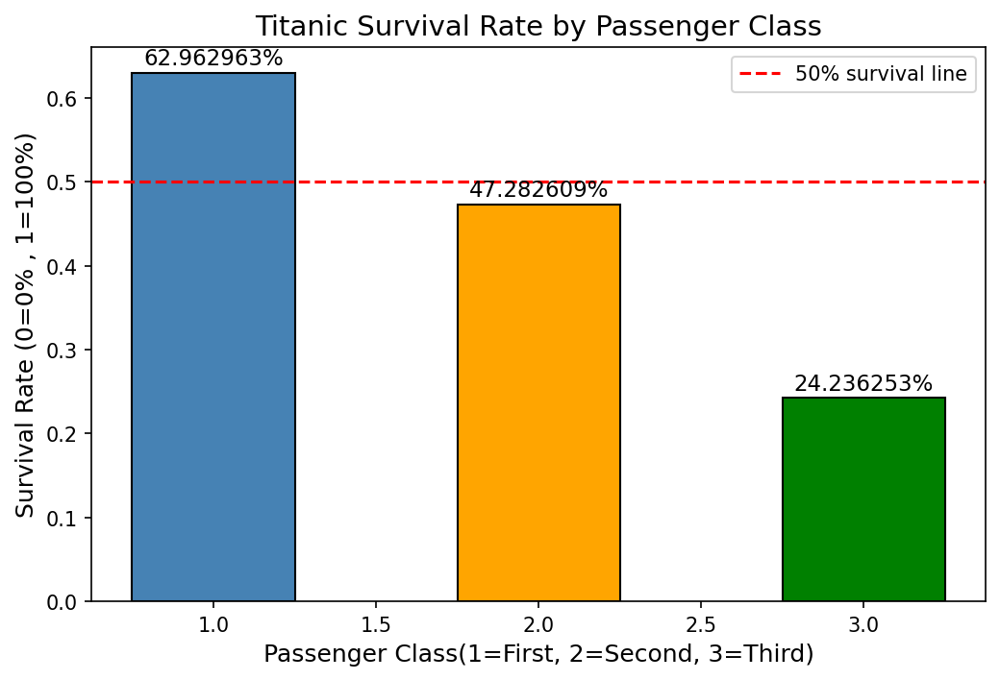
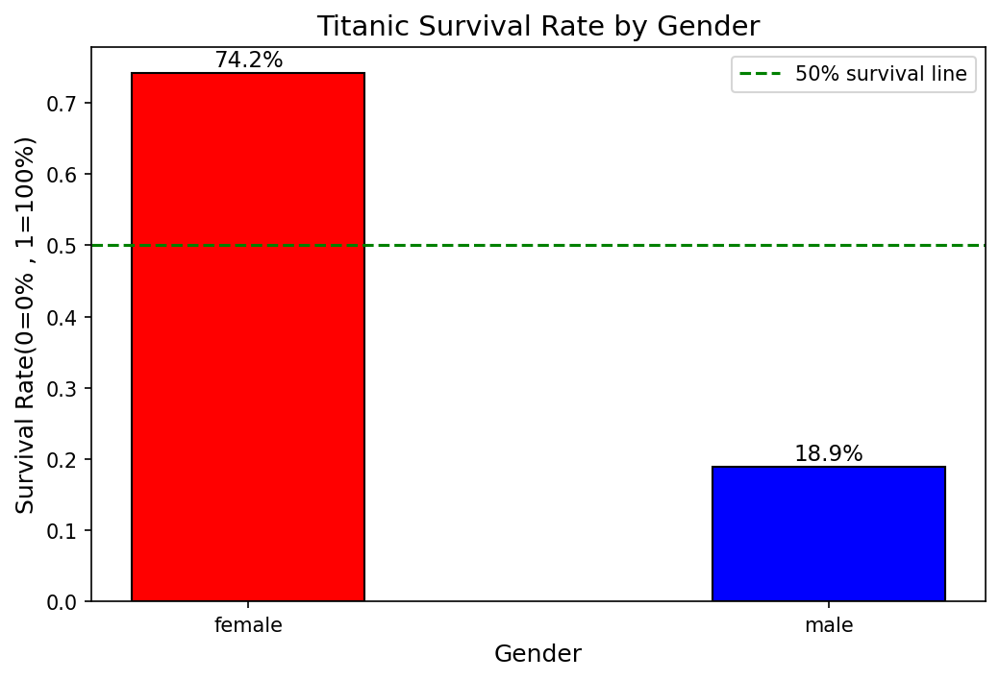
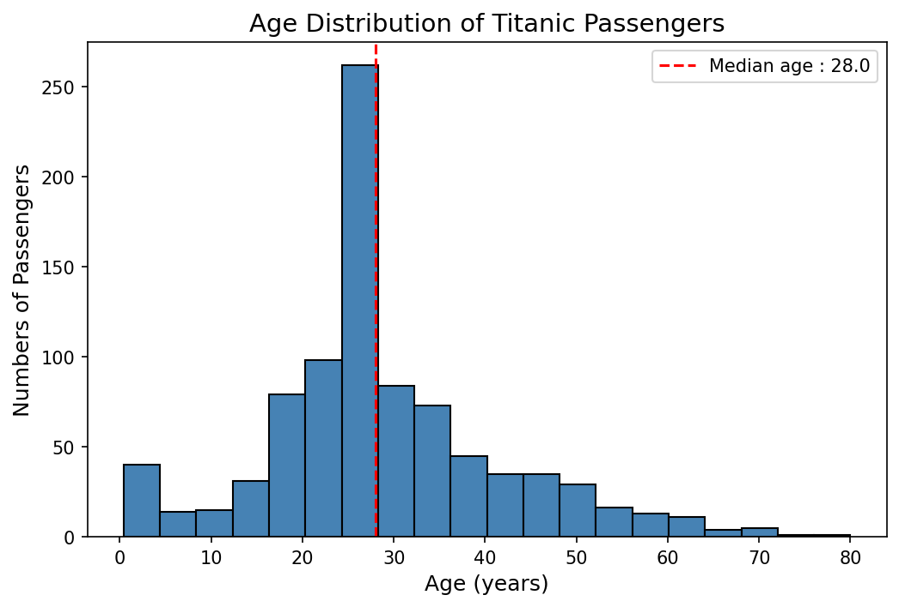
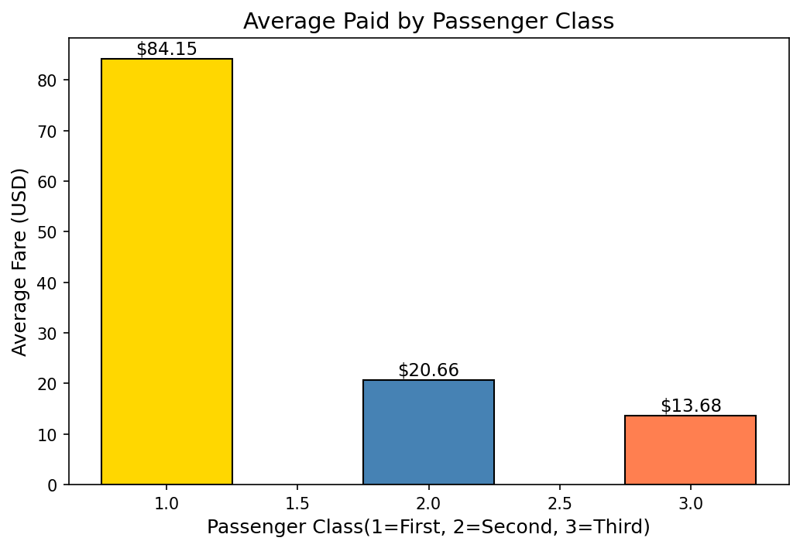

# Titanic Survival Analysis
### Exploratory Data Analysis | Python | pandas | Matplotlib

---

## Problem
What determined whether a passenger survived the Titanic disaster?
Could survival be predicted from demographic and economic factors
available at the time of boarding?

**Business Context:** Insurance companies, emergency planners, and
Transportation safety regulators use survival pattern analysis to
assess risk factors and design equitable emergency protocols.

---

## Data
- **Source:** Kaggle — Titanic: Machine Learning from Disaster
- **Size:** 891 passengers, 12 variables
- **Key variables:** Pclass, Sex, Age, Fare, Embarked, Survived

**Data Quality Issues Resolved:**
- Age: 177 missing values → filled with median (28.0)
- Cabin: 687 missing (77%) → converted to Has_Cabin True/False flag
- Embarked: 2 missing → filled with mode (Southampton)

---

## Solution

**Tools:** Python, pandas, NumPy, Matplotlib

**Approach:**
1. Loaded and inspected the raw dataset
2. Cleaned three types of missing data
3. Engineered the Has_Cabin feature as a proxy variable
4. Analyzed survival rates across class, gender, fare, and port
5. Visualized four key findings with Matplotlib

---

## Key Findings

| Finding | Result |
|---------|--------|
| First class survival | 63% vs third class 24% |
| Female survival | 74% vs male 19% |
| First class female survival | 97% |
| Survivors' average fare | $48.40 vs $22.12 non-survivors |
| Port Cherbourg survival | 55% — highest of three ports |
| Has_Cabin survival | 67% True vs 30% False |

---

## Business Impact
- **Emergency Protocol Design:** Deck location determined survival
  more than any other factor. Equitable exit access regardless of
  ticket class would have increased third-class survival by an
  estimated 39 percentage points.
- **Insurance Underwriting:** Third class male passengers represent
  the highest risk demographic — lowest fare paid, lowest survival
  rate, highest exposure.
- **Port Strategy:** Cherbourg's 55% survival rate reflects passenger
  composition, not geography — a proxy variable insight applicable
  to any segmentation analysis.

---

## Visualizations

---

## Skills Demonstrated
`Python` `pandas` `NumPy` `Matplotlib` `Data Cleaning`
`Exploratory Data Analysis` `Feature Engineering` `Data Visualization`
`Business Insight Communication`

---

## Files
- `week6_titanic.py` — cleaning and analysis code
- `week7_matplotlib.py` — visualization code
- `chart1_survival_by_class.png` — survival by class
- `chart2_survival_by_gender.png` — survival by gender
- `chart3_age_distribution.png` — age distribution
- `chart4_fare_by_class.png` — average fare by class

---

*Author: Raida Tasnim Islam | PhD Candidate, Information Technology*
*Notion Site: https://www.notion.so/raida-islam/Raida-Islam-Portfolio-33843088b7a480be8620d40e733d269c?source=copy_link 
